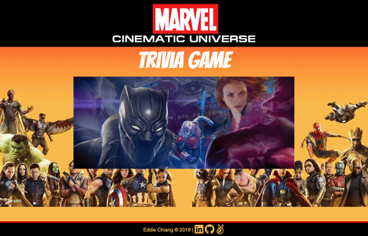

# Trivia Game
Comic book superheros have hit the big screen! Test your knowledge of the Marvel Cinematic Universe. This is a fun and interactive game using JavaScript for the logic coding and jQuery to manipulate the timing (using timeouts and intervals) and dynamically update the HTML.

### Game Interface

Instructions:
* You have 15 seconds to answer each trivia question before it is marked incorrect.
* There are a total of 10 questions.
* Once the game is over, click on the restart button to try another set of randomly selected numbers.
* Make sure you turn up your volume to enjoy the full video and sound effect.

Click on the link to play!
https://echiang73.github.io/TriviaGame/

### Built with
* HTML5
* CSS3
* JavaScript
* jQuery
* Responsive Web Design Media Query
* Use of timing events with setTimeout and setInterval, video, sound, pseudocodes

Here's are the previews of the game:

